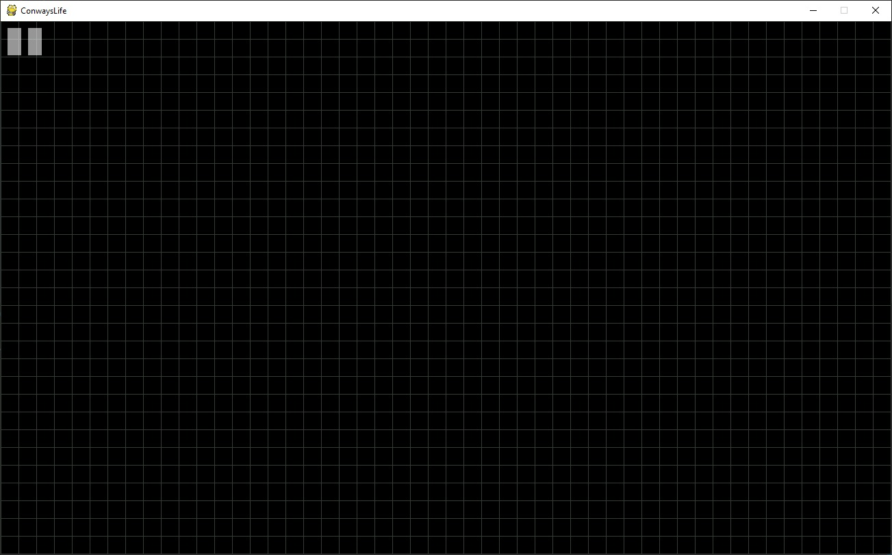
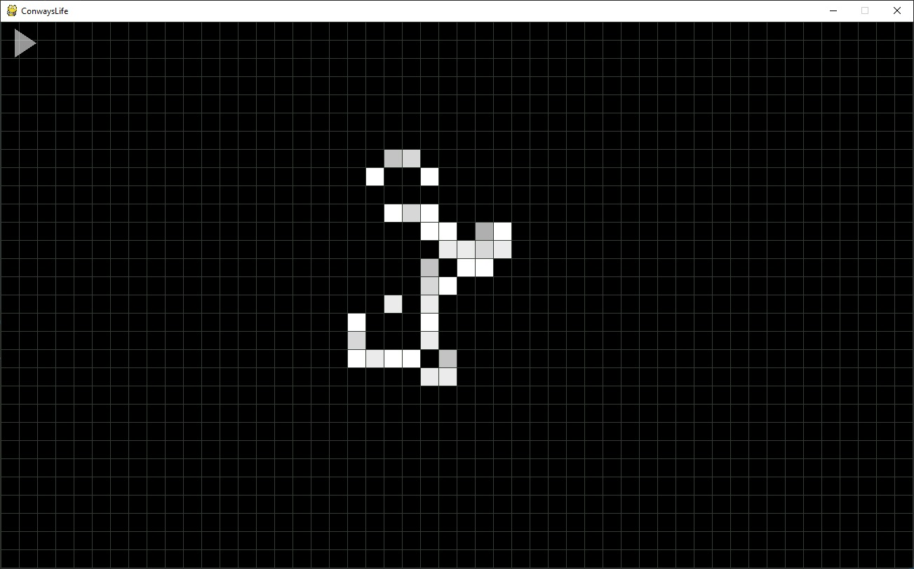
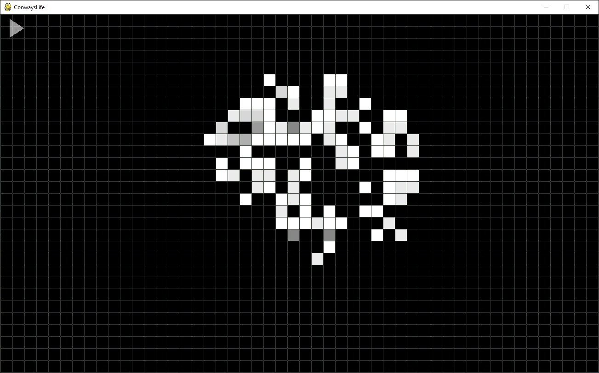
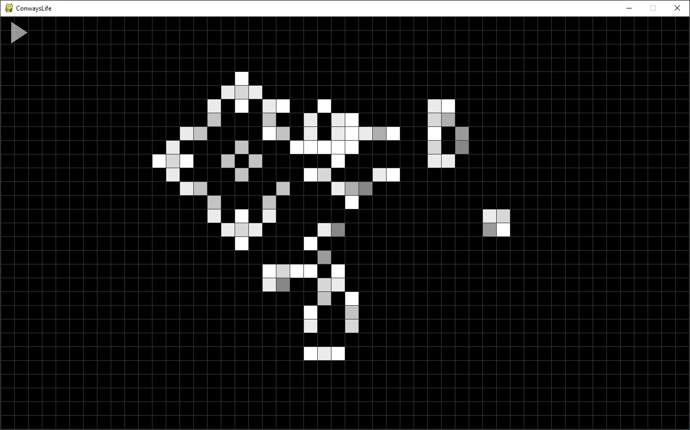

# ConwaysLife
Клеточный автомат "Жизнь"

Простейшая реализация клеточного автомата "Жизнь" (изобретенного Джоном Конвеем) на языке Python. Для работы скрипта требуется библиотека pygame. С помощью мышки можно выставить начальную конфигруацию автомата (левой кнопкой ставим клетки в ячейки поля, правой - убираем). После того, как начальная конфигурация выставлена, можно запустить "смену поколений" нажав пробел. В любой момент смену поколений можно поставить на паузу также нажав пробел.
От себя я внес в правила только одно небольшое дополнение: клетки не могут жить вечно и через девять поколений в любом случае умирают от старости.

Скриншоты ниже.

